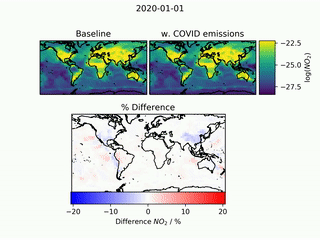

[ LinkedIn](https://www.linkedin.com/in/luke-fakes-03192abb/)
[ ORCiD](https://orcid.org/0000-0002-8906-6772)

## About Me
I'm a PhD Student at the Wolfson Atmospheric Chemistry Laboratories (WACL), Universty of York. My research looks at modelling atmospheric composition over the UK using the open source, [GEOS-Chem](http://wiki.seas.harvard.edu/geos-chem/index.php/Main_Page) model. Most of my coding is done in [python](https://www.python.org/), but I'm also familiar with R and SQL, with a touch of FORTRAN. 

## My Research Highlights
In December 2020, I presented my work *"Predicting the effect of anthropogenic emission reductions due to COVID-19 restrictions with an atmospheric chemistry model"* at the [AGU 2020](https://www.agu.org/) conference. This used global emissions adjusted to account for national COVID-19 lockdown restrictions ([Forster at et al, 2020](https://www.nature.com/articles/s41558-020-0883-0)) to estimate the changes in key atmospheric pollutants at the global and regional (United Kingdom) level.

Co-author:
* Global impact of COVID-19 restrictions on the surface concentrations of nitrogen dioxide and ozone, Atmos. Chem. Phys., C.A. Keller et al, 2020 (DOI: [10.5194/acp-21-3555-2021](https://www.researchgate.net/deref/http%3A%2F%2Fdx.doi.org%2F10.5194%2Facp-21-3555-2021?_sg%5B0%5D=7hh61KcFniP5lZyUnSGUrs1JdGKbbqoQ5Y7MFtOltpf8-bTPomKBeQGEDU4OHncxFGWsYnKq_zITXbI8__TdFKDu1A.sXMD157_KhOg8Y6Vb3ZSL76_SZtv_RP9fnDWIcTKPCpFee23Q8CJB7mQNRd6aSNXPny4MN5tJUc-7ZWZ5zE_KA))

## Background/Qualifications
* **(Current) Doctor of Philosophy, Chemistry**, Department of Chemistry, University of York
* **MSc Data Science & Analytics**, Department of Mathematics, University of Leeds. 
* **MChem Chemistry with a Year in Industry**, Department of Chemistry, University of York

<!--
**LukeFakes/LukeFakes** is a ✨ _special_ ✨ repository because its `README.md` (this file) appears on your GitHub profile.

Here are some ideas to get you started:

!## My Interests

- 🔭 I’m currently working on ...
- 🌱 I’m currently learning ...
- 👯 I’m looking to collaborate on ...
- 🤔 I’m looking for help with ...
- 💬 Ask me about ...
- 📫 How to reach me: ...
- 😄 Pronouns: ...
- ⚡ Fun fact: ...
-->
